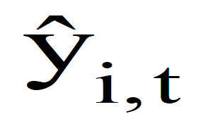
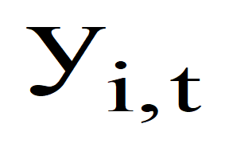
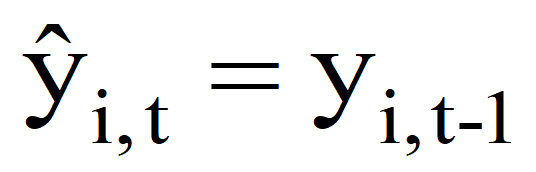
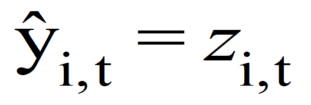

Selective Editing Specification
===============================

Overview
--------

================= ============================
**Method**        **Status**
================= ============================
Selective Editing Complete and quality assured
================= ============================

===================== =======================================================================================================
Descriptive           Details
===================== =======================================================================================================
Description           Selective editing – Score calculation, combining function and flagging
                     
                      1. *To generate a separate selective editing score for up to 5 specified variables.*
                     
                      2. *Combine the separate scores into one overall selective editing score.*
                     
                      3. *Flag records with an overall selective editing score that are above a pre-defined threshold input.*
Method theme          Editing.
Method classification Editing and imputation expert group.
===================== =======================================================================================================

Method Specification
--------------------

Method Specification Amendments/Change Log
~~~~~~~~~~~~~~~~~~~~~~~~~~~~~~~~~~~~~~~~~~

==================== ============================================= ============================================== ============================ ===============================================================================================================================================================================
**Document version** **Description**                               **Author(s)**                                  **Date**                     **Comments\***
==================== ============================================= ============================================== ============================ ===============================================================================================================================================================================
*1.0*                *First draft or amendment (minor/major)*      *Name and email*                               *Publication/amendment date* *What changes have been made?*
*1.0*                Initial Specification                         *Phil Lewis*                                                               
                                                                                                                                              
                                                                   Editing.and.Imputation.expert.group@ons.gov.uk                             
                                                                                                                                              
                                                                   *Secondary reviewer:*                                                      
                                                                                                                                              
                                                                   *Claire Dobbins*                                                           
                                                                                                                                              
                                                                   *claire.dobbins@ons.gov.uk*                                                
*1.1*                *Specification after UAT – SML version 2.2.2* *Peter Davies*                                 *01/04/2020*                 *-Removed dates from the inputs table and the process flow as they are not needed.*
                                                                                                                                              
                                                                   Peter.davies@ons.gov.uk                                                     *-Renamed predictor flag and error flag to input and output flag respectively.*
                                                                                                                                              
                                                                   *Secondary reviewer*                                                        *-Updated the pre-processing requirements to reflect that domain mapping, threshold mapping and the standardising factor are expected to be mapped before starting the method.*
                                                                                                                                              
                                                                   *Claire Dobbins*                                                           
                                                                                                                                              
                                                                   Claire.dobbins@ons.gov.uk                                                  
*1.2*                                                              *Phil Lewis*                                   *22/06/2020*                 Minkowski parameter P is an integer greater than or equal to 1.
                                                                                                                                              
                                                                   Editing.and.Imputation.expert.group@ons.gov.uk                              | Not sure why someone added bound of 10?
                                                                                                                                               | *(The max function is the limit as p tends to infinity!)*
                                                                                                                                              
                                                                                                                                               |image0| is defined to use the previous value as the predictor.
                                                                                                                                              
                                                                                                                                               *Added 4*-week, 4-week, 5-week reporting pattern comments.
                                                                                                                                              
                                                                                                                                               *Updated equations*
*1.3*                *Update Status*                               *Jonathan Digby-North*                         *06/08/2020*                 Updated Status to ‘complete’ after sign off of defect resolution (see UAT)
==================== ============================================= ============================================== ============================ ===============================================================================================================================================================================

Summary
~~~~~~~

-  *Selective editing is an efficient micro editing methodology.*

-  *This methodology targets respondents that would have a significant
   impact on published estimates to be validated.*

-  *The aim is to reduce the number of edit failures (where possible) to
   be investigated, in comparison to traditional micro editing, but with
   minimal impact on key outputs.*

“S\ *elective Editing* targets only some of the micro data items or
records for review, by prioritising the manual work and establishing
appropriate and efficient process and edit boundaries. Selective editing
focuses in minimising the review of records in error so as to obtain
reasonable data aggregates such as totals. This objective is well
supported by the fact that published studies of traditional editing
processes indicate that many originally reported values are being
changed by insignificant amounts and that few errors are responsible for
the majority of the total change.

In summary, selective editing works because a small percentage of the
edits account for a large percentage of the change to an estimate during
editing.”

M. A Hidiroglou (2004).

Requirements and Dependencies
~~~~~~~~~~~~~~~~~~~~~~~~~~~~~

Prior to the calculation of a single combined score, ensure all data
inputs are available (that is, all individual scores may be calculated),
and, that an approach to combining scores is specified.

The thresholds are a pre-defined input. They are usually fixed for
multiple rounds / periods of time.

SML Estimation may be required before this method. That is, to produce
the required design weights (a-weight) data input for the selective
editing methodology.

Assumptions and Validity
~~~~~~~~~~~~~~~~~~~~~~~~

1. All data inputs required by the method are available and are on a
   standardised basis.

..

   That is, the “Adjusted returns”, “Predicted value”, “Auxiliary
   predicted value” and “Standardising factor” inputs are all in the
   same units (for example actual pounds) and represent the same
   periodicity (for examples monthly values, 5-week period, etc.).

2. The domain mapping and domain threshold mapping is complete.

3. The standardising factor has been linked to appropriate records, via
   the domain value, before applying the method.

4. The domain selective editing threshold has been linked to appropriate
   records, via the domain value, before applying the method.

5. The auxiliary variables should be a good predictor of the target
   variable.

   If such an appropriate auxiliary is not available, then this method
   should not be used.

6. The predicted value in the score calculation must have been cleaned
   and be free of errors.

   However, it does not have to be limited to genuine returns. That is,
   it may be an imputed or a constructed value if a clean response is
   not available.

7. This method may only be applied up to 5 variables.

..

   That is, up to and including 5 selective editing scores may be
   combined for a given respondent.

8.  Each respondent must be clearly classified into one mutually
    exclusive domain group.

    If a domain group has not been assigned to a given respondent, then
    the method cannot be applied, and the user must be made aware that
    selective editing has failed to run.

9.  The thresholds are valid and appropriate.

    The thresholds are an input and are not calculated by the function.
    The function does not validate the suitability of the threshold.

10. If the “weighted mean score” is selected to combine scores, then the
    sum of the weights provided should total to 1.

Method Input
~~~~~~~~~~~~~

.. tabularcolumns:: |p{\dimexpr 0.10\linewidth-2\tabcolsep}|p{\dimexpr 0.10\linewidth-2\tabcolsep}|p{\dimexpr 0.10\linewidth-2\tabcolsep}|p{\dimexpr 0.10\linewidth-2\tabcolsep}|p{\dimexpr 0.10\linewidth-2\tabcolsep}|p{\dimexpr 0.10\linewidth-2\tabcolsep}|p{\dimexpr 0.10\linewidth-2\tabcolsep}|p{\dimexpr 0.30\linewidth-2\tabcolsep}|

.. rst-class:: longtable

======================================================= ================================= ======================================================================================================================== =============================================================== ====================================================================================================================== ==================================================== ===================================================================================================================== ==================================================================================================================================================================================================================================================================================================================================================
Variable definition                                     Type of variable                  Format of specific variable (if applicable)                                                                              Expected range of the values                                    Meaning of the values                                                                                                  Expected level of aggregation                        Frequency                                                                                                             Comments
======================================================= ================================= ======================================================================================================================== =============================================================== ====================================================================================================================== ==================================================== ===================================================================================================================== ==================================================================================================================================================================================================================================================================================================================================================
*e.g. 10-digit enterprise reference number*             *e.g. character; integer; double* *e.g. date*                                                                                                              *e.g.*                                                          *e.g.*                                                                                                                 *e.g.*                                               *e.g. quarterly, monthly, annual*                                                                                    
                                                                                                                                                                                                                                                                                                                                                                                                                                                                                                                                                                                    
                                                                                          *YYYY-MM-DD*                                                                                                             *weights should be greater than 0*                              *Stagger = 0 indicates that the reporting period is a month*                                                           *RU level;*                                                                                                                                                               
                                                                                                                                                                                                                                                                                                                                                                                                                                                                                                                                                                                    
                                                                                                                                                                                                                                                                                                                                                                                                          *VAT unit level; Enterprise level*                                                                                                                                        
Standard Industrial Classification code                 Numeric                                                                                                                                                                                                                    Defines which industry a respondent is based within.                                                                                                                                                                                                                                              Each respondent will have a SIC code defined and obtained from the Inter-Departmental Business Register (IDBR).
                                                                                                                                                                                                                                                                                                                                                                                                                                                                                                                                                                                    
                                                                                                                                                                                                                                                                                                                                                                                                                                                                                                                                                                                     This industry code is required to identify which selective editing domain group the respondent lies within.
Selective Editing Domain Group                          Numeric                                                                                                                                                    Domain group must be present in look-up table                   States which selective editing domain group a given business belongs to.                                               Reporting unit level                                                                                                                                                       The domain group is required to identify the correct standardising factor and threshold to apply for a given respondent.
Look-up table: Selective Editing Domain Group mapping   Numeric                           SIC code should be same data format as SIC 2007 codes (standard attribute in survey data sourced from business register) All respondent SIC codes should be present in the look-up table Mapping low-level Standard Industrial Classifications (SIC) to defined selective editing domain groups                 SIC code at reporting unit level;                    Fixed inputs specified by Methodology division for a specific output                                                  This look-up table should be specified by Methodology Division for each survey that requires this method.
                                                                                                                                                                                                                                                                                                                                                                                                                                                                                                                                                                                    
                                                                                                                                                                                                                                                                                   This may be expanded upon such that a look-up table may require mapping from SIC and survey /form type to domain group Mapping from low-level to high-level SIC aggregation                                                                                                                       Look-up table used to identify the selective editing domain group that the Reporting Unit is a member of.
Indicator – total variables requiring score calculation Integer                                                                                                                                                    1, 2, 3, 4, or 5.                                               States the number of variables which require selective editing scores to be calculated (and combined if required).                                                                                                                                                                                Selective editing can be applied to up to 5 variables.
                                                                                                                                                                                                                                                                                                                                                                                                                                                                                                                                                                                    
                                                                                                                                                                                                                                                                                                                                                                                                                                                                                                                                                                                     If applied to more than one variable, then the scores need to be combined to one overall score.
                                                                                                                                                                                                                                                                                                                                                                                                                                                                                                                                                                                    
                                                                                                                                                                                                                                                                                                                                                                                                                                                                                                                                                                                     This indicator identifies if it necessary to combine variable scores.
                                                                                                                                                                                                                                                                                                                                                                                                                                                                                                                                                                                    
                                                                                                                                                                                                                                                                                                                                                                                                                                                                                                                                                                                     *The number of variables required are survey specific and should be specified by Methodology Division.*
Adjusted return                                         Numeric                                                                                                                                                                                                                    This is the most recent unedited returned data value (for a given variable) in the current period (time t).            Reporting unit level                                 Any frequency (subject to frequency of survey data collection)                                                        Selective editing is typically applied to key survey variables such as total turnover (provided a suitable predictor value exists).
                                                                                                                                                                                                                                                                                                                                                                                                                                                                                                                                                                                    
                                                                                                                                                                                                                                                                                                                                                                                                                                                                                                                                                                                     If the method is applied to more than one variable, then adjusted returned values should be specified for each score separately.
Predicted value                                         Numeric                                                                                                                                                                                                                    This is the first predictor value (for a given variable) for the current period Adjusted Return.                       Reporting unit level                                 Any frequency (subject to frequency of survey data collection)                                                        This is the best available predicted value for the current period adjusted returns (time t).
                                                                                                                                                                                                                                                                                                                                                                                                                                                                                                                                                                                    
                                                                                                                                                                                                                                                                                                                                                                                                                                                                                                                                                                                     Selective editing should only be specified if an appropriate predictor exists. (e.g. if current and previous period data are well correlated, then clean edited previous period data [time t-1] can be specified as the predicted value. If clean returned data is not available, imputed or constructed previous period data may also be used).
                                                                                                                                                                                                                                                                                                                                                                                                                                                                                                                                                                                    
                                                                                                                                                                                                                                                                                                                                                                                                                                                                                                                                                                                     If the method is applied to more than one variable, then predicted values should be specified for each score separately.
Auxiliary predicted value                               Numeric                                                                                                                                                                                                                    This is the (secondary) auxiliary predictor (for a given variable) for the current period Adjusted Return.             Reporting unit level                                 Register-based values are annual; would need to be converted to appropriate frequency to correspond with survey data. If the best predicted value for the current period adjusted is not available, then the auxiliary predicted value should be used.
                                                                                                                                                                                                                                                                                                                                                                                                                                                                                                                                                                                    
                                                                                                                                                                                                                                                                                                                                                                                                                                                               | Data may need to be converted to 5-week reporting period.                                                           **Selective editing should only be specified if an appropriate auxiliary predictor exists**. (e.g. if current period data and a register-based variable are well correlated, then a modified register-based variable could be used as the auxiliary predicted value).
                                                                                                                                                                                                                                                                                                                                                                                                                                                               | For example, for the last block if the survey follows a 4-week, 4-week, 5-week reporting pattern.                  
                                                                                                                                                                                                                                                                                                                                                                                                                                                                                                                                                                                     It may be necessary to modify register values to make them comparable with the adjusted returned data (e.g. ensure same periodicity and unit value).
                                                                                                                                                                                                                                                                                                                                                                                                                                                                                                                                                                                    
                                                                                                                                                                                                                                                                                                                                                                                                                                                                                                                                                                                     If the method is applied to more than one variable, then auxiliary predicted values should be specified for each score separately.
Standardising factor                                    Numeric                                                                                                                                                                                                                    This is the selective editing domain group estimate used to standardise scores within a given domain group.            Selective editing domain group level                 Any frequency (subject to frequency of survey data collection).                                                       Each respondent has a score calculated which is standardised by a domain group estimate (standardising factor).
                                                                                                                                                                                                                                                                                                                                                                                                                                                                                                                                                                                    
                                                                                                                                                                                                                                                                                                                                                                                                                                                                                                                                                                                     The standardising factor will vary depending on what domain group a given respondent is based within and time period.
                                                                                                                                                                                                                                                                                                                                                                                                                                                                                                                                                                                    
                                                                                                                                                                                                                                                                                                                                                                                                                                                                                                                                                                                     The standardising factor should be based upon the same variable as the predicted value but should be weighted (that is, if the previous period edited turnover value is used as the predictor, then the standardising factor should be the previous period edited weighted turnover domain estimate for the respondent’s respective domain group).
                                                                                                                                                                                                                                                                                                                                                                                                                                                                                                                                                                                    
                                                                                                                                                                                                                                                                                                                                                                                                                                                                                                                                                                                     Standardising scores allows the user to interpret the contribution a respondent is expected to make towards a given domain level estimate.
                                                                                                                                                                                                                                                                                                                                                                                                                                                                                                                                                                                    
                                                                                                                                                                                                                                                                                                                                                                                                                                                                                                                                                                                     If an auxiliary predicted value is used in the score calculation, then the standardising factor should remain on the same basis as the predicted value.
Design weight                                           Numeric                                                                                                                                                    Must be greater than or equal to 1                                                                                                                                                     Reporting unit level                                                                                                                                                       This should be the design weight (known as a-weight). This may be generated as an output from another SML method: Estimation.
                                                                                                                                                                                                                                                                                                                                                                                                                                                                                                                                                                                    
                                                                                                                                                                                                                                                                                                                                                                                                                                                                                                                                                                                     The design weight can vary by respondent (subject to sample design) and time period.
Look-up table: Selective editing thresholds                                                                                                                                                                                                                                        Unique threshold for each selective editing domain group                                                               Domain group level                                                                                                                                                         The overall (final) score should be compared with the respective domain group threshold.
                                                                                                                                                                                                                                                                                                                                                                                                                                                                                                                                                                                    
                                                                                                                                                                                                                                                                                                                                                                                                                                                                                                                                                                                     If the score is greater than or equal to the threshold, the respondent fails selective editing
                                                                                                                                                                                                                                                                                                                                                                                                                                                                                                                                                                                    
                                                                                                                                                                                                                                                                                                                                                                                                                                                                                                                                                                                     (that is, the record requires manual review);
                                                                                                                                                                                                                                                                                                                                                                                                                                                                                                                                                                                    
                                                                                                                                                                                                                                                                                                                                                                                                                                                                                                                                                                                     else it passes.
Combining function                                                                                                                                                                                                                                                                 If the method is applied to more than one variable, then scores can be combined in the following ways:                                                                                                                                                                                            If the method is applied to more than one variable, then the method will need to know how to combine the scores.
                                                                                                                                                                                                                                                                                                                                                                                                                                                                                                                                                                                    
                                                                                                                                                                                                                                                                                   Average, Sum, Maximum, Weighted mean, Minkowski distance                                                                                                                                                                                                                                          *Methodology division are required to specify the required function for a given survey.*
Combining weights                                                                                                                                                                                                  :math:`0 \leq w_{j} \leq 1` :math:`\sum_{j = 1}^{M}w_{j} = 1`   Weight for each of the M scores; total of weights should sum to 1.                                                                                                                                                                                                                                *Only required if the weighted mean score combination is selected*
                                                                                                                                                                                                                                                                                                                                                                                                                                                                                                                                                                                    
                                                                                                                                                                                                                                                                                                                                                                                                                                                                                                                                                                                     *These combining weights should be specified by Methodology division for a specific survey.*
Minkowski_parameter_P                                   Integer                                                                                                                                                    .. math:: 1 \leq p                                              Minkowski distance parameter.                                                                                                                                                                                                                                                                     *Only required if Minkowski distance function is selected to combine scores.*
                                                                                                                                                                                                                                                                                                                                                                                                                                                                                                                                                                                    
                                                                                                                                                                                                                                                                                                                                                                                                                                                                                                                                                                                     *Parameter value to be specified by Methodology division.*
======================================================= ================================= ======================================================================================================================== =============================================================== ====================================================================================================================== ==================================================== ===================================================================================================================== ==================================================================================================================================================================================================================================================================================================================================================

Method Output
~~~~~~~~~~~~~

.. tabularcolumns:: |p{\dimexpr 0.10\linewidth-2\tabcolsep}|p{\dimexpr 0.10\linewidth-2\tabcolsep}|p{\dimexpr 0.10\linewidth-2\tabcolsep}|p{\dimexpr 0.10\linewidth-2\tabcolsep}|p{\dimexpr 0.10\linewidth-2\tabcolsep}|p{\dimexpr 0.10\linewidth-2\tabcolsep}|p{\dimexpr 0.10\linewidth-2\tabcolsep}|p{\dimexpr 0.30\linewidth-2\tabcolsep}|

.. rst-class:: longtable

=========================================== ================================= =========================================== ================================== =================================================================================== ================================== ================================= ====================================================================================================================================================================================================================================
Variable definition                         Type of variable                  Format of specific variable (if applicable) Expected range of the values       Meaning of the values                                                               Expected level of aggregation      Frequency                         Comments
=========================================== ================================= =========================================== ================================== =================================================================================== ================================== ================================= ====================================================================================================================================================================================================================================
*e.g. 10-digit enterprise reference number* *e.g. character; integer; double* *e.g. date*                                 *e.g.*                             *e.g.*                                                                              *e.g.*                             *e.g. quarterly, monthly, annual*
                                                                                                                                                                                                                                                                                                                     
                                                                              *YYYY-MM-DD*                                *weights should be greater than 0* *Stagger = 0 indicates that the reporting period is a month*                        *RU level;*                                                         
                                                                                                                                                                                                                                                                                                                     
                                                                                                                                                                                                                                                 *VAT unit level; Enterprise level*                                  
Score1                                      Numeric                                                                       Positive number                    Selective editing score for the first specified variable.                           Reporting unit level                                                 *Generated by the score function for variable 1.*
                                                                                                                                                                                                                                                                                                                     
                                                                                                                                                                                                                                                                                                                      *When selective editing is being applied to more than one variable, this is an interim output (required by Methodology for testing purposes and future analysis)*
ScoreM                                      Numeric                                                                       Positive number                    Selective editing score for the “M”th (1< M <= 5) specified variable.               Reporting unit level                                                 *Generated by the score function for the variable M.*
                                                                                                                                                                                                                                                                                                                     
                                                                                                                                                             There may only be up to 5 variable scores for a given respondent.                                                                                        *When selective editing is being applied to more than one variable, this is an interim output (required by Methodology for testing purposes and future analysis)*
Final_Score                                 Numeric                                                                       Positive number                                                                                                        Reporting unit level                                                 This is the final overall selective editing score for a given respondent to inform whether they require validation.
                                                                                                                                                                                                                                                                                                                     
                                                                                                                                                                                                                                                                                                                      *When selective editing is applied to only one variable, this should be equal to Score1.*
Input flag1                                 Character                                                                     ‘P’, ‘A’, M’.                      P to indicate primary predictor use in score.                                       Reporting unit level                                                 This provides diagnostic information to aid user understanding of what inputs have been used in the score function for variable 1.
                                                                                                                                                                                                                                                                                                                     
                                                                                                                                                             A to indicate auxiliary predictor use in score.                                                                                                          This could be made available for each variable which has a score calculated.
                                                                                                                                                                                                                                                                                                                     
                                                                                                                                                             M to indicate score not calculated as critical input missing.                                                                                            Just needed for methodology analysis purposes?
Output Flag                                 Character                                                                     ‘P’, ‘F’, ‘M’                      P to indicate the respondent does not require validation (passed selective editing) Reporting unit level                                                 The output flag should only relate to the final_score.
                                                                                                                                                                                                                                                                                                                     
                                                                                                                                                             F to indicate the respondent does require validation (failed selective editing).                                                                         A respondent fails selective editing (and requires validation) if the final_score is greater than or equal to their respective threshold;
                                                                                                                                                                                                                                                                                                                     
                                                                                                                                                             M to indicate critical input missing.                                                                                                                    else it passes selective editing.
                                                                                                                                                                                                                                                                                                                     
                                                                                                                                                                                                                                                                                                                      The marker values may be subject to change. May need to align with preferred terminology from BDOD (teams responsible for validating data); but should still have a relevant ‘pass’, ‘fail’, ‘critical input missing’ flag assigned.
=========================================== ================================= =========================================== ================================== =================================================================================== ================================== ================================= ====================================================================================================================================================================================================================================

**Respondent data may be validated / run through selective editing more
than once in a given period. This may be because certain data inputs
required by the score calculation have been updated as part of live
production processes. Therefore, for a given respondent at a given time
period, there may be several iterations of variable scores created.
While business processes (e.g. re-contacting businesses to validate
data) is always based on the most recent version of a selective editing
score, Methodology division require access to all vintages of scores to
inform the research and the analysis required to both update and
maintain thresholds. If the SML module does not directly store all
vintages of scores, then any pipeline in which this method is integrated
into should consider the requirements to retain useful metadata to
improve methods for the future.**

Statistical Process Flow/Formal Definition
~~~~~~~~~~~~~~~~~~~~~~~~~~~~~~~~~~~~~~~~~~

Part A: Selective editing score calculation

*(Scores may be calculated for up to a total of 5 key variables for each
respondent)*

1) For all records that have an assigned selective editing domain group
– apply the following steps to generate an output:

-  A selective editing score is calculated for each reporting unit i in
   time t.

If any respondents are not assigned to selective editing domain group,
then a score must not be calculated, and a warning should be presented
to the user.

2) Calculate :math:`{\widehat{y}}_{i,t}`\ for each respondent

|image1|

Where

-  i is the reporting unit.

-  :math:`{\widehat{y}}_{i,t}` is the predicted value for reporting unit
   i at time t.

-  :math:`{\widehat{y}}_{i,t - 1}` is the adjusted return for reporting
   unit i at time t-1.

-  |image2| is the auxiliary predicted value for reporting unit i at
   time t.

-  The predicted value is the clean edited previous period data.

However, if this is not available then imputed or constructed previous
period data may also be used.

-  This may require to be date adjusted.

..

   For example, if the previous period value represents a 4-week period
   and the current period represents a 5-week period.

If this is not available (e.g. respondent may not have been sampled in
previous period), then an auxiliary predicted value should be used. This
is typically a register-based variable, which is correlated well with
the variable of interest. This variable must be converted such that it
is has the same unit value and periodicity as the survey returns; this
can vary depending on which survey is having this methodology applied.
Register-based values are annual; would need to be converted to
appropriate frequency to correspond with survey data.

-  | Data may need to be converted to 5-week reporting period.
   | For example, for the last block if the survey follows a 4-week,
     4-week, 5-week reporting pattern.

3) Calculate the variable score for each respondent

.. math:: \text{scor}e_{i,t} = \frac{100 \times \left| y_{i,t} - {\widehat{y}}_{i,t} \right| \times a_{i,t}}{T_{i,t}}

Where

-  i is the reporting unit

-  |image3| is the adjusted return for reporting unit i at time t

-  |image4| is the predicted value for reporting unit i at time t
   (Calculated in step 2)

-  :math:`a_{i,t}` is the design weight for reporting unit i at time t.
   (This may have been calculated via the SML estimation module.)

-  :math:`T_{i,t}\ ` is the standardising factor for reporting unit i at
   time t

If the predicted value is based upon previous period data, then the
standardising factor should also be based on previous period data. This
should be previous period selective editing domain estimate (that is,
weighted previous period estimate for the variable of interest within
the respondent’s respective domain group).

4) If any required data inputs for the score function are missing /null
then output flag M (for Missing) to indicate an error.

Otherwise,

   If (in step 2))

   |image5| then flag ‘P’ (for Predictor),

   Else if (in step 2))

   |image6| then flag ‘A’ (for auxiliary).

Note that:

-  If one of :math:`y_{i,t - 1}`, :math:`z_{i,t}\ `\ exists then the M
   flag should not be output.

-  If both of :math:`y_{i,t - 1}`, :math:`z_{i,t}` are missing then the
   M flag should be output under the input flag.

-  If any of the other data inputs stated in steps 1 – 3 are missing,
   then the M flag should be output under the input flag.

**If selective editing is applied to more than one variable, then repeat
steps 1 – 4 with the appropriate data inputs and move onto part B.**

**If selective editing is only applied to one variable, the variable
score is equivalent to the final score and move onto part C.**

############################################################################

.. warning::

   Part B has not been developed or tested at this point

**Part B: Combining scores**

*(Only required if selective editing is applied to more than one
variable)*

Set of scores :math:`s_{i,j}` where :math:`i` is a business and *j* are
the different scores from variables :math:`j = 1,\ldots,M` (up to a
maximum of 5 variable scores to be combined).

Note that if M=1:

That is, there is only one score, then :math:`s_{i} = s_{i,1}`\ by
definition.

(The same result should, in this case, be generated by any of the
overall score functions below.)

The overall (final) score may be combined in the following ways:

-  Maximum score :math:`s_{i} = \max_{j = 1,\ldots,M}s_{i,j}`

-  Weighted mean score :math:`s_{i} = \sum_{j = 1}^{M}{w_{j}s_{i,j}}`
   where :math:`\sum_{j = 1}^{M}w_{j} = 1`

-  The mean score :math:`s_{i} = \frac{1}{M}\sum_{j = 1}^{M}s_{i,j}`

Note this is a special case of the weight mean score where
:math:`w_{j} = \frac{1}{M}` for all :math:`j`.

-  Minkowski distance
   :math:`s_{i} = \left( {\sum_{j = 1}^{m}\left( s_{i,j} \right)}^{p} \right)^{\frac{1}{p}}`
   where :math:`1 \leq p` (integer)

Note that if M=1:

That is, there is only one score, then :math:`s_{i} = s_{i,1}`\ by
definition.

The same result should, in this case, be generated by any of the overall
score functions.

############################################################################

**Part C: Generate final selective editing output flag**

1. For all records that have an assigned selective editing domain group
   – apply the following steps:

2. If final overall score :math:`s_{i}` is greater than or equal to the
   selective editing threshold for the domain group (that :math:`i` is a
   member of)

..

   then output the output flag marker for reporting unit :math:`i` as
   ‘F’ (for failed selective editing and requires validation).

3. If final overall score :math:`s_{i}` is less than the selective
   editing threshold for the domain group (that is a member of)

..

   then output the output flag marker for reporting unit :math:`i` as
   ‘P’ (for passed selective editing and does not require validation).

4. If either the final overall score or required selective editing
   threshold is missing,

   Then output the output flag marker for reporting unit :math:`i` as
   ‘M’ (for Missing critical input).

5. *Only required if combining score functions have been used (weighted
   mean or Minkowski distance):*

   The output flag marker for reporting unit should output ‘M’ in the
   following cases (under these conditions, a final overall score should
   not be able to be calculated):

-  If the p value in the Minkowski distance is missing or takes an
   invalid value

-  Score weights in weighted mean score are missing or do not sum to 1

Worked Example
~~~~~~~~~~~~~~

Scenarios to be Tested
~~~~~~~~~~~~~~~~~~~~~~

Treatment of Special Cases
~~~~~~~~~~~~~~~~~~~~~~~~~~

If any required values are missing or are null, then output flag M (for
Missing) to indicate an error.

Example (Synthetic) Data 
~~~~~~~~~~~~~~~~~~~~~~~~~

Code
~~~~

See :doc:`smls.methods\`

http://np2rvlapxx507/DAP-S/Statistical_Methods_Library_Small/blob/master/smls/methods/selective_editing.py

Issues for Consideration
~~~~~~~~~~~~~~~~~~~~~~~~

Links
~~~~~

References
~~~~~~~~~~

Selective Editing Implementation:

https://share.sp.ons.statistics.gov.uk/sites/MTH/BusStat/_layouts/15/WopiFrame.aspx?sourcedoc=/sites/MTH/BusStat/Mon/Distributive_Trade/PE_and_I/DTrades%20selective%20editing%20implementation.docx&action=default&DefaultItemOpen=1

M. A Hidiroglou (2004):

https://share.sp.ons.statistics.gov.uk/sites/MTH/Trg/_layouts/15/WopiFrame.aspx?sourcedoc=/sites/MTH/Trg/Int/Induction_material/PE_and_I/Selective%20Editing_short.doc&action=default&DefaultItemOpen=1
(references within this)

Key References on Selective Editing:

-  De Jong, A. (2003), "IMPECT: Recent Developments in Harmonized
   Processing and Selective Editing," *Conference of European
   Statisticians: Work Session on Statistical Data Editing*.

-  Farwell, K. (2005), "The General Application of Significance Editing
   to Economic Collections," Technical, Australian Bureau of Statistics.

-  Hedlin, D. (2003), "Score Functions to Reduce Business Survey Editing
   at the UK Office for National Statistics," *Journal of Official
   Statistics*, 19, 177-199.

-  Hedlin, D. (2008), "Local and Global Score Functions in Selective
   Editing," *Conference of European Statisticians, Work Session on
   Statistical Data Editing*, 8.

-  Hidiroglou, M. A., and Berthelot, J.-M. (1986), "Statistical Editing
   and Imputation for Periodic Business Surveys," *Survey Methodology*,
   12, 73-83.

-  Latouche, M., and Berthelot, J.-M. (1992), "Use of a Score Function
   to Prioritize and Limit Recontacts in Editing Business Surveys,"
   *Journal of Official Statistics*, 8, 389-400.

-  Lawrence, D., and McDavitt, C. (1994), "Significance Editing in the
   Australian Survey of Average Weekly Earnings," *Journal of Official
   Statistics*, 10, 437-447.

-  Lawrence, D., and McKenzie, R. (2000), "The General Application of
   Significance Editing," *Journal of Official Statistics*, 16, 243-253.

-  Nordberg, A., and Arvidson, G. (2008), "New Tools for Statistical
   Data Editing," *Work Session on Statistical Data Editing*, 10.

-  Silva, P. L. d. N. (2007), "Selective Editing," *Short course on
   editing and imputation*, 22.

**
**

Appendix (optional)
~~~~~~~~~~~~~~~~~~~

