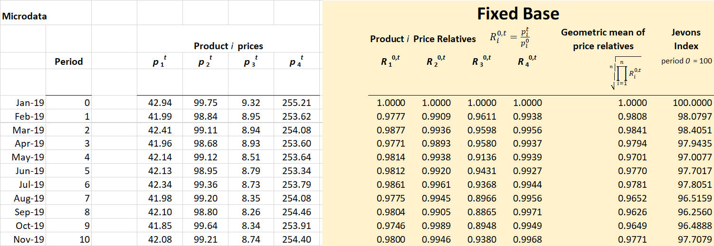

Jevons Fixed Base Index
=======================

Overview
--------

======================= ==========================================================================================================================================================================================================================
Descriptive             Details
======================= ==========================================================================================================================================================================================================================
Support Area            Index.Numbers.Expert.Group@ons.gov.uk
Version                 *Latest version*
Methods reference       **Filled in by DST**
*Description*           Jevons fixed base is a well-known method for calculating the unweighted price index of items using a geometric average of price relatives over different periods. The formula is as follows:
                       
                        .. math:: P_{\text{FBJ}}^{0,t} = {\prod_{j\  \in S}^{}\left( \frac{p_{j}^{t}}{p_{j}^{0}} \right)}^{\frac{1}{n}}
                       
                        Where :math:`p_{j}^{t}\ `\ is the price of the product j in time period t, S is the set of all products that appear in both the base period and the current period, and n is the number of products common to all periods.
*Method theme*          *Index Number / Consumer Price*
*Method classification* *Unweighted Price Index – Fixed base Jevons*
Status                  *Prototype, peer review, meets coding standards, unit tested*
Inputs                  *Name and description of inputs*
Outputs                 *Name and description of outputs*
======================= ==========================================================================================================================================================================================================================

Method Specification
--------------------

Method Specification Amendments/Change Log
~~~~~~~~~~~~~~~~~~~~~~~~~~~~~~~~~~~~~~~~~~

==================== ======================================== ========================================== ============ =================
**Document version** **Description**                          **Author(s)**                              **Date**     **Comments\***
==================== ======================================== ========================================== ============ =================
*1.0*                *First draft or amendment (minor/major)* *Alex Rose; alexander.rose@ons.gov.uk*     *04/09/2020* *First Draft*
*1.1*                *Secondary Reviewer Sign off*            *Dr Gareth Clews; gareth.clews@ons.gov.uk* *07/09/2020* *No changes made*
\                                                                                                                    
==================== ======================================== ========================================== ============ =================

Summary
~~~~~~~

The Fixed Based Jevons fixes the base period to the first period in the
dataset and matches the products common to all periods. This is the main
method used in constructing the elementary aggregates in the Consumer
Prices Index including owner occupiers’ housing costs (CPIH). It
compares the current period price back to the base period. The formula
is defined as follows:

.. math:: P_{\text{FBJ}}^{0,t} = {\prod_{j\  \in S}^{}\left( \frac{p_{j}^{t}}{p_{j}^{0}} \right)}^{\frac{1}{n}}

**The advantages of the Fixed Based Jevons include the fact that there
is a direct comparison from the base period to the current period and
that it tracks individual products across time. It is also relatively
straightforward and easy to explain and follows the methodology that is
currently used in CPIH.**

The Fixed Based Jevons index will suffer in markets where there is high
product churn. This is because when you get further away from the base
period, the less likely it is that products are going to remain in the
sample.

The Chained Jevons and the GEKS Jevons should be suggested as suitable
alternatives once these methods are added to the SML.

Requirements and Dependencies
~~~~~~~~~~~~~~~~~~~~~~~~~~~~~

**Requires a time series of product level prices that have been suitably
classified to an item category.**

Assumptions and Validity
~~~~~~~~~~~~~~~~~~~~~~~~

Minimal product churn; A subset of products available in the base period
should be available in each subsequent period to ensure an index can be
calculated rather than a NAN output. The method would still be valid
(indices could be calculated) if the assumption is violated however its
outputs would be unreliable and unfit for purpose.

Method Input
~~~~~~~~~~~~~

.. tabularcolumns:: |p{\dimexpr 0.10\linewidth-2\tabcolsep}|p{\dimexpr 0.10\linewidth-2\tabcolsep}|p{\dimexpr 0.10\linewidth-2\tabcolsep}|p{\dimexpr 0.10\linewidth-2\tabcolsep}|p{\dimexpr 0.10\linewidth-2\tabcolsep}|p{\dimexpr 0.10\linewidth-2\tabcolsep}|p{\dimexpr 0.10\linewidth-2\tabcolsep}|p{\dimexpr 0.30\linewidth-2\tabcolsep}|

.. rst-class:: longtable

================================= ================== =========================================== ============================ ===================== ============================= ===================================== ==========================================================================================================
Variable definition               Type of variable   Format of specific variable (if applicable) Expected range of the values Meaning of the values Expected level of aggregation Frequency                             Comments
================================= ================== =========================================== ============================ ===================== ============================= ===================================== ==========================================================================================================
**Item**                          *String*                                                                                                                                                                              *Item to which product belongs. E.g. in COICOP the product “Smirnoff Ice” belongs to the Item “Alcopops”.*
Unique Product Code/ Product Name *Integer / String*                                                                                                                                                                    *This could be product name / SKU / URL / or and assigned number depending on input data set.*
Price                             *Float*                                                        *Greater than zero*                                                                                                   
Date                              *date*             *YYYY-MM-DD*                                                                                                                 *Daily/weekly/monthly user selection*
\                                                                                                                                                                                                                      
================================= ================== =========================================== ============================ ===================== ============================= ===================================== ==========================================================================================================

.. _section-1:

Method Output
~~~~~~~~~~~~~

.. tabularcolumns:: |p{\dimexpr 0.10\linewidth-2\tabcolsep}|p{\dimexpr 0.10\linewidth-2\tabcolsep}|p{\dimexpr 0.10\linewidth-2\tabcolsep}|p{\dimexpr 0.10\linewidth-2\tabcolsep}|p{\dimexpr 0.10\linewidth-2\tabcolsep}|p{\dimexpr 0.10\linewidth-2\tabcolsep}|p{\dimexpr 0.10\linewidth-2\tabcolsep}|p{\dimexpr 0.30\linewidth-2\tabcolsep}|

.. rst-class:: longtable

=================== ================ =========================================== ============================ ============================================ ============================= ========= ========
Variable definition Type of variable Format of specific variable (if applicable) Expected range of the values Meaning of the values                        Expected level of aggregation Frequency Comments
=================== ================ =========================================== ============================ ============================================ ============================= ========= ========
Date                *date*           *YYYY-MM-DD*                                                                                                                                                 
Item                String                                                                                                                                                                        
Jevons Index Value  Float                                                        First period = 100           Shows the ratio change in price of the item.                                        
\                                                                                                                                                                                                 
\                                                                                                                                                                                                 
\                                                                                                                                                                                                 
=================== ================ =========================================== ============================ ============================================ ============================= ========= ========

Statistical Process Flow/Formal Definition
~~~~~~~~~~~~~~~~~~~~~~~~~~~~~~~~~~~~~~~~~~

.. math:: P_{\text{FBJ}}^{0,t} = {\prod_{j\  \in S}^{}\left( \frac{p_{j}^{t}}{p_{j}^{0}} \right)}^{\frac{1}{n}}

Where :math:`p_{j}^{t}\ `\ is the price of the product j in time period
t, S is the set of all products that appear in both the base period and
the current period, and n is the number of products common to all
periods.

1. Calculate the Price Relative, R = price in current period t / price
   in base period 0, for each product that has a price in both periods

2. Calculate the geometric mean of the price relatives, multiply by 100
   to give the fixed base Jevons Index for period t

3. Repeat steps 1 and 2 for each current period in the time series

Worked Example
~~~~~~~~~~~~~~

|image0|

.. _section-2:

Scenarios to be Tested
~~~~~~~~~~~~~~~~~~~~~~

.. _section-3:

Treatment of Special Cases
~~~~~~~~~~~~~~~~~~~~~~~~~~

.. _section-4:

Example (Synthetic) Data
~~~~~~~~~~~~~~~~~~~~~~~~

:download:`Synthetic Data for Jevons Fixed Based <../../../specifications/index_numbers/jevons_fixed_base/SML_FixedBaseJevons_Data.xlsx>`

Code
~~~~

http://np2rvlapxx507/EPDS/cprices/blob/develop/cprices/alternative_sources/index_methods/jevons.py

.. _section-5:

Issues for Consideration
~~~~~~~~~~~~~~~~~~~~~~~~

.. _section-6:

Links
~~~~~

http://np2rvlapxx507/EPDS/cprices/blob/develop/cprices/alternative_sources/index_methods/jevons.py

.. _section-7:

References
~~~~~~~~~~

https://www.ons.gov.uk/economy/inflationandpriceindices/articles/newindexnumbermethodsinconsumerpricestatistics/2020-09-01#annex-a-technical-descriptions-of-index-number-methods

https://www.ons.gov.uk/methodology/methodologicalpublications/generalmethodology/onsworkingpaperseries/onsmethodologyworkingpaperseriesnumber12acomparisonofindexnumbermethodologyusedonukwebscrapedpricedata#price-index-methods-for-use-on-web-scraped-prices-data

.. _section-8:

Appendix (optional)
~~~~~~~~~~~~~~~~~~~

