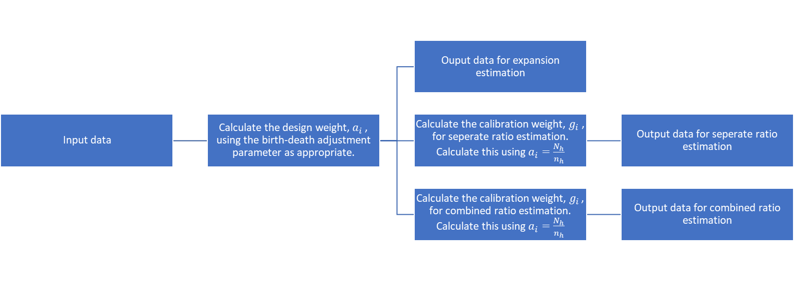

Estimation Specification 
=========================

Overview
--------

======================= =====================================================================================================
Descriptive             Details
======================= =====================================================================================================
Support Area            *Methodology – sample design & estimation expert group.* Sample.Design.Estimation.Business@ons.gov.uk
Version                 *2.4*
Methods reference       **Filled in by DST**
*Description*           *Creates weights*
*Method theme*          *Sample design and estimation*
*Method classification* *Specify type of method*
Status                  *Prototype, peer review, meets coding standards, unit tested*
Inputs                  *Name and description of inputs*
Outputs                 *Name and description of outputs*
======================= =====================================================================================================

Method Specification
--------------------

Method Specification Amendments/Change Log
~~~~~~~~~~~~~~~~~~~~~~~~~~~~~~~~~~~~~~~~~~

==================== ======================================== ======================================== ============================ ==================================================================================================================================================================================================
**Document version** **Description**                          **Author(s)**                            **Date**                     **Comments\***
==================== ======================================== ======================================== ============================ ==================================================================================================================================================================================================
*1.0*                *First draft or amendment (minor/major)* *Name and email*                         *Publication/amendment date* *What changes have been made?*
*1.0*                *First major*                            *Laura Kirkham laura.kirkham@ons.gov.uk* *13/5/20*                    *Comprehensive spec created*
*2.0*                *2\ nd major*                            *Laura Kirkham*                          *14/5/20*                    *Correction to calibration factor calculation. References added*
*2.1*                *Minor change*                           *Jonathan Digby-North*                   *14/5/2020*                  *Combined ratio estimation g-weight calc made clearer.*
*2.2*                *Minor update*                           *Jonathan Digby-North*                   *18/05/2020*                 *Added metadata of functions*
*2.3*                *Minor corrections and alterations*      *Laura Kirkham*                          *9/6/2020*                   *Altered indexing of method for clarity.*
                                                                                                                                   
                                                                                                                                    *Altered indexing of example for clarity.*
                                                                                                                                   
                                                                                                                                    *Amended assumption in example.*
                                                                                                                                   
                                                                                                                                    *Amended assumption for birth-death adjustment in treatment of special cases.*
*2.4*                *Minor changes*                          *Laura Kirkham*                          *7/4/2021*                   *Extra information around data checks, extra clarity, replaced pictures with equations for accessibility. Process flow .png file added to Jira*
*3.0*                *Major changes*                          *Laura Kirkham*                          *5/7/21*                     *Output dataset at stratum/cell level.*
                                                                                                                                   
                                                                                                                                    *Removed exclusion marker, explained anything not to be included in calculation should be removed in pre-wrangling. Updated H input and output description. Updated Inclusion marker description.*
*3.1*                *Minor changes*                          *Laura Kirkham*                          *18/3/22*                    *Included flag in output dataset to indicate if weights are acceptable, or whether a sample redesign is advisable.*
*3.2*                *Minor changes*                          *Laura Kirkham*                          *22/3/22*                    *Included more info for flag in output dataset to indicate if weights are acceptable, or whether a sample redesign is advisable.*
*3.3*                *Minor changes*                          *Bryan Cotterell*                        *18/5/22*                    *Added information on weighting using out of scope adjustments; also other minor changes – corrected terminology from calibration weight to calibration factor*
==================== ======================================== ======================================== ============================ ==================================================================================================================================================================================================

**\*** *Comments can include whether two versions of the method are
being used.*

Summary
~~~~~~~

This specification covers expansion estimation and ratio estimation.

**Design-weight**

All design-based estimation methods create a design weight,
:math:`a`-weight, using universe and sample counts and a `birth-death
and out of scope
adjustment <https://share.sp.ons.statistics.gov.uk/sites/MTH/BusStat/_layouts/15/WopiFrame.aspx?sourcedoc=/sites/MTH/BusStat/Mon/Distributive_Trade/SD_and_E/Birth%20death%20spec.docx&action=default>`__
which can be ‘turned off’ if no death marker and out of scope marker is
in the data set or :math:`H`-value. The proportion of businesses who are
sampled or have a response/imputation is used to create a factor, the
design weight, which represents non-sampled, and non-responded
businesses in some cases.

**Birth death and out of scope adjustment**

Currently, birth-death adjustment is either ‘on’ or ‘off’ depending on
the given value for H.

:math:`H = 0`: birth-death adjustment not being used. Assume no births.

:math:`H = 1`: birth-death adjustment being used. Assume births =
deaths.

When there are out of scope units, these parameters also affect the out
of scope adjustments.

Note

.. note::

‘Births’ refers to the number of births during the sampling period and
‘Deaths’ refers to the number of deaths during the sampling period.

**Calibration-factor**

If methodology has deemed available auxiliary data as appropriate, ratio
estimation is used; a calibration factor, :math:`g`-weight, is
calculated using said auxiliary data and the a-weight. If no available
auxiliary data is appropriate for the variable being weighted, expansion
estimation is used, where the :math:`g`-weight is not calculated nor
used in subsequent methods (such as outliering and aggregation). The
calibration factor adjusts the sample for being unrepresentative in
terms of the auxiliary variable. Note that the term calibration factor
is used by Statistics Canada. Most literature refers to
:math:`g`-weights.

**Strengths**

-  Relatively simple to use and check

-  Well known and widely used

-  Statistical properties understood

-  Stratified random sampling widely used

-  Expansion estimation: Unbiased estimator

-  Ratio estimation: Bias small for large enough sample

-  Ratio estimation: Bias is small if the sample design is reasonable

**Limitations**

-  Requires random sampling – best under stratified random sampling

-  Requires appropriate sample design

-  Requires retrieval of population totals

-  Ratio estimation requires additional auxiliary data

-  Improper use of ratio estimation can lead to poor quality estimates –
   there must be a suitably strong linear relationship between the
   auxiliary data and the target variable, otherwise expansion
   estimation is better

**Alternative methods**

-  Model estimation methods

-  Regression estimation – more complex method

.. _section-1:

Requirements and Dependencies
~~~~~~~~~~~~~~~~~~~~~~~~~~~~~

-  Requires a joined universe and selection file to run.

-  Data to be in correct format (i.e. no symbol characters etc.).

-  Check that the birth-death and out of scope assumptions are
   appropriate at the time of use.

-  Validation may need to occur before Estimation if the birth-death
   adjustment is being used.

-  Some surveys partially impute for non-response. This affects where
   and/or the number of times the Estimation method should be run.
   Sampled businesses who are non-responders and will not be imputed for
   (usually small businesses), should not be included in the (final)
   calculation of weights. Validation and selective editing may use
   weights in the validation process. If this is the case, the
   Estimation method should be run before these methods, calculating the
   design weights and calibration factors based on the sample. Once
   validation, selective editing and imputation are run, the Estimation
   method should be run again, calculating the design weights and
   calibration factors based on only the businesses who now have a value
   for the target variable.

Assumptions and Validity
~~~~~~~~~~~~~~~~~~~~~~~~

**Birth-death and out of scope adjustment**

Currently the birth-death adjustment’s parameter, :math:`H`, only takes
values 0 or 1.

:math:`H = 0` : assume no births. Sampled deaths will respond a real 0
and the estimate will reflect the deaths, no birth adjustment is needed
as we are assuming there are none.

:math:`H = 1` : assume births = deaths. Use of birth-death adjustment
also assumes that all deaths have been recorded correctly at the time of
Estimation. The real 0 responses from the dead businesses are reflected
in the estimate, the birth death adjustment increases the estimate
slightly to reflect births in the population. This assumption can only
be made in appropriate circumstances (e.g. if an industry were dying it
would not be appropriate to make this assumption).

Note that these parameters also affect the out of scope adjustments;
when these are used, the *H* parameter is not a pure birth-death
adjustment.

See treatment of special cases for :math:`H \neq 0` and
:math:`H \neq 1`.

**Ratio estimation**

For ratio estimation, there must be a suitably strong relationship
between the variable and the auxiliary variable – determined by
Methodology. Improper use of auxiliary data and ratio estimation will
result in poor quality estimates. In the case where there is no suitably
strong relationship between the variable and available auxiliary
variables, expansion estimation can be used.

Method Input
~~~~~~~~~~~~~

.. tabularcolumns:: |p{\dimexpr 0.10\linewidth-2\tabcolsep}|p{\dimexpr 0.10\linewidth-2\tabcolsep}|p{\dimexpr 0.10\linewidth-2\tabcolsep}|p{\dimexpr 0.10\linewidth-2\tabcolsep}|p{\dimexpr 0.10\linewidth-2\tabcolsep}|p{\dimexpr 0.10\linewidth-2\tabcolsep}|p{\dimexpr 0.10\linewidth-2\tabcolsep}|p{\dimexpr 0.30\linewidth-2\tabcolsep}|

.. rst-class:: longtable

Method should expect fully populated columns for reference number,
period, cell and inclusion marker.

In addition, if the birth-death adjustment is being used, the method
should expect fully populated columns for H, death marker; if ratio
estimation is being used, the method should expect fully populated
auxiliary variable & calibration group. If out of scope adjustment is
made, the method should also expect a fully populated column for the out
of scope marker.

Any data that should not be weighted should be removed in pre-wrangling
before the method is run.

==================================================== ================================= =========================================== ================================== ============================================================== ==================================================== ================================= ======================================================================================================================================================================================================================================================================
Variable definition                                  Type of variable                  Format of specific variable (if applicable) Expected range of the values       Meaning of the values                                          Expected level of aggregation                        Frequency                         Comments
==================================================== ================================= =========================================== ================================== ============================================================== ==================================================== ================================= ======================================================================================================================================================================================================================================================================
*e.g. 10-digit enterprise reference number*          *e.g. character; integer; double* *e.g. date*                                 *e.g.*                             *e.g.*                                                         *e.g.*                                               *e.g. quarterly, monthly, annual*
                                                                                                                                                                                                                                                                                                                           
                                                                                       *YYYY-MM-DD*                                *weights should be greater than 0* *Stagger = 0 indicates that the reporting period is a month*   *RU level;*                                                                           
                                                                                                                                                                                                                                                                                                                           
                                                                                                                                                                                                                                     *VAT unit level; Enterprise level*                                                    
*Reference number*                                                                                                                                                                                                                   *RU (reporting unit) level OR LU (local unit) level*                                  
*Period*                                             *Date*                                                                                                                                                                                                                                                                
*Cell*                                               *Integer (usually 4 digit)*                                                                                                                                                     *RU/LU level*                                                                          *Number to indicate which stratum a business belongs to*
*Inclusion marker*                                   *integer*                                                                     *0,1*                              *1 = included in* :math:`n_{h}`                                *RU/LU level*                                                                          *Marker of use will depend on what is desired.*
                                                                                                                                                                                                                                                                                                                           
                                                                                                                                                                      *0 = not to be included in* :math:`n_{h}`                                                                                                             *If want to calculate weights based on the sample counts, will want sample marker.*
                                                                                                                                                                                                                                                                                                                           
                                                                                                                                                                                                                                                                                                                            *If want to calculate weights based on responses and imputed/constructed values will want a response/imputed marker.*
                                                                                                                                                                                                                                                                                                                           
                                                                                                                                                                                                                                                                                                                            *This method may be run twice, once at the beginning to calculate weights (using sample counts) which can be used for validation, selective editing and imputation, then again after imputation (based on response/imputed values) to calculate weights for grossing.*
*Auxiliary variable*                                 *Numeric*                                                                                                                                                                       *RU/LU level*                                                                          *See assumptions for use in ratio estimation. Not required for expansion estimation.*
*H                                                   *numeric*                                                                     :math:`\geq 0`                     :math:`H = 0` : assume no births                               *Strata/cell level*                                                                    *H must be consistent within a stratum but can be different across strata*
(birth-death and out of scope adjustment parameter)*                                                                                                                                                                                                                                                                       
                                                                                                                                                                      :math:`H \in \left( 0,1 \right)` : assume births < deaths                                                                                            
                                                                                                                                                                                                                                                                                                                           
                                                                                                                                                                      :math:`H = 1` : assume births = deaths                                                                                                               
                                                                                                                                                                                                                                                                                                                           
                                                                                                                                                                      :math:`H > 1` : assume births > deaths                                                                                                               
*Death marker*                                       *numeric*                                                                     *0,1*                              *0 = not dead*                                                                                                                                        *Marker to indicate which businesses have died*
                                                                                                                                                                                                                                                                                                                           
                                                                                                                                                                      *1 = dead*                                                                                                                                            *(must be present for birth-death adjustment, but may not be present if birth-death adjustment not being used)*
*Out of scope marker*                                *Numeric*                                                                     *0,1*                              *0 = in scope*                                                                                                                                        *Marker to indicate out of scope units selected in the sample; needed if out of scope marker adjustment used*
                                                                                                                                                                                                                                                                                                                           
                                                                                                                                                                      *1= out of scope*                                                                                                                                    
*Calibration group / model group*                    *string*                                                                                                         *Provides group which calibration factors are calculated over* *RU/LU level*                                                                          *For separate ratio estimation, point this at cell. For combined ratio estimation this should contain calibration groups*
*Out of scope/birth-death flag*                      *numeric*                                                                     0, 1, 2, 3                         *0 = no out of scope or birth and death adjustment*                                                                                                   *Equations listed below*
                                                                                                                                                                                                                                                                                                                           
                                                                                                                                                                      *1 = birth-death adjustment (Equation 1)*                                                                                                            
                                                                                                                                                                                                                                                                                                                           
                                                                                                                                                                      *2 = out of scope adjustment 1 (Equation 2)*                                                                                                         
                                                                                                                                                                                                                                                                                                                           
                                                                                                                                                                      *3 = out of scope adjustment 2 (Equation 3)*                                                                                                         
==================================================== ================================= =========================================== ================================== ============================================================== ==================================================== ================================= ======================================================================================================================================================================================================================================================================

.. _section-2:

.. note::

   This method does not require the target variable which is being
   weighted as the weights do not calculate using any returns or
   imputed/constructed values. The inclusion marker should be
   appropriate for identifying those businesses who should be included
   in counts, or whose auxiliary data should be used in calculations.

Method Output
~~~~~~~~~~~~~

=================================================================== ================================= =========================================== ==================================== ============================================================= ======================================= ================================= ========================================================================================================================================================
Variable definition                                                 Type of variable                  Format of specific variable (if applicable) Expected range of the values         Meaning of the values                                         Expected level of aggregation           Frequency                         Comments
=================================================================== ================================= =========================================== ==================================== ============================================================= ======================================= ================================= ========================================================================================================================================================
*e.g. 10-digit enterprise reference number*                         *e.g. character; integer; double* *e.g. date*                                 *e.g.*                               *e.g.*                                                        *e.g.*                                  *e.g. quarterly, monthly, annual*
                                                                                                                                                                                                                                                                                                                              
                                                                                                      *YYYY-MM-DD*                                *weights should be greater than 0*   *Stagger = 0 indicates that the reporting period is a month*  *RU level;*                                                              
                                                                                                                                                                                                                                                                                                                              
                                                                                                                                                                                                                                                     *VAT unit level; Enterprise level*                                       
*Period*                                                            *Date*                                                                                                                                                                                                                                                    
*Cell*                                                              *Integer (usually 4 digit)*                                                                                                                                                      *RU level*                                                                *Number to indicate which stratum a business belongs to*
*Design weight* :math:`a_{i}`                                       *Numeric*                                                                     .. math:: \geq 1                                                                                   *Strata / RU level*                                                      
*Birth-death and out of scope adjusted design weight* :math:`a_{i}` *Numeric*                                                                     .. math:: \geq 1                                                                                   *Strata / RU level*                                                       *If birth-death/out of scope adjustment is being used, both adjusted and unadjusted design weight should be in output data*
*Calibration factor* :math:`g_{i}`                                  *Numeric*                                                                     .. math:: g \in \lbrack 0.3,3\rbrack                                                               *Strata / calibration group / RU level*                                   *Anything outside of [0.3,3] should be treated as suspicious.*
                                                                                                                                                                                                                                                                                                                              
                                                                                                                                                                                                                                                                                                                               *May be larger than 3 when cut-off sampling is used and methodology has assessed the quality balance & has deemed these weights acceptable for purpose.*
*Out of scope/birth-death flag*                                     *numeric*                                                                     0, 1, 2, 3                           *0 = no out of scope or birth and death adjustment*                                                                                     *See equations below*
                                                                                                                                                                                                                                                                                                                              
                                                                                                                                                                                       *1 = birth-death adjustment (Equation 1)*                                                                                              
                                                                                                                                                                                                                                                                                                                              
                                                                                                                                                                                       *2 = out of scope adjustment 1 (Equation 2)*                                                                                           
                                                                                                                                                                                                                                                                                                                              
                                                                                                                                                                                       *3 = out of scope adjustment 2 (Equation 3)*                                                                                           
*Adjustment factor*                                                 *numeric*                                                                                                          *Terms in brackets below: e.g. for equation 1*                                                                                         
                                                                                                                                                                                                                                                                                                                              
                                                                                                                                                                                       .. math:: 1 + H_{h}\left( \frac{d_{h}}{n_{h} - d_{h}} \right)                                                                          
*FLAG*                                                              *String*                                                                      Acceptable                           *Weights in acceptable range*                                                                                                           *If* :math:`1 < a_{i} < 2` *“*\ Warning – sample redesign advised”
                                                                                                                                                                                                                                                                                                                              
                                                                                                                                                  Warning – sample redesign advised    *Weights unacceptable and sample design review advised*                                                                                 If :math:`a_{i}g_{i} < 1` *“*\ Warning – sample redesign advised” (only for ratio estimation)
                                                                                                                                                                                                                                                                                                                              
                                                                                                                                                                                                                                                                                                                               If :math:`g_{i} < 0.3` *“*\ Warning – sample redesign advised” (only for ratio estimation)
                                                                                                                                                                                                                                                                                                                              
                                                                                                                                                                                                                                                                                                                               If :math:`g_{i} > 3` *“*\ Warning – sample redesign advised” (only for ratio estimation)
                                                                                                                                                                                                                                                                                                                              
                                                                                                                                                                                                                                                                                                                               Else “Acceptable”
=================================================================== ================================= =========================================== ==================================== ============================================================= ======================================= ================================= ========================================================================================================================================================

Statistical Process Flow/Formal Definition
~~~~~~~~~~~~~~~~~~~~~~~~~~~~~~~~~~~~~~~~~~

1. **Notation**

-  :math:`i` denotes a single business or RU / LU

-  :math:`j` denotes a different single business or RU / LU

-  :math:`h` denotes a single stratum (cell)

-  :math:`k` denotes a calibration group

-  :math:`N_{h}` denotes the population count for stratum :math:`h`

-  :math:`n_{h}` denotes the sample/responder count for
   stratum\ :math:`\text{\ h}`

-  :math:`d_{h}` denotes the death count for stratum\ :math:`\text{\ h}`

-  :math:`H_{h}` denotes the birth-death / out of scope adjustment
   parameter for stratum\ :math:`\text{\ h}`, which takes value 0 or 1

-  :math:`x_{i}` denotes the auxiliary variable for business :math:`i`

-  :math:`u_{h}` denotes out of scope units in stratum *h*

   1. **Expansion Estimation**

The design weight, :math:`a_{h}` , is calculated at stratum level, for
each RU. The formula for birth and death adjustments is:

Equation 1:

.. math:: a_{h} = \frac{N_{h}}{n_{h}}\left( 1 + H_{h}\left( \frac{d_{h}}{n_{h} - d_{h}} \right) \right)

Two formulae are required for birth-death and out of scope adjustments:

Equation 2:

.. math:: a_{h} = \frac{N_{h}}{n_{h}}\left( 1 + H_{h}\left( \frac{d_{h}}{n_{h} - d_{h} - u_{h}} \right) \right)

Equation 3

.. math:: a_{h} = \frac{N_{h}}{n_{h}}\left( 1 + H_{h}\left( \frac{d_{h} + u_{h}}{n_{h} - d_{h} - u_{h}} \right) \right)

Note all businesses belonging to a given stratum, :math:`h` , will have
the same design weight. i.e.
:math:`\forall i,j \in h,\ \ a_{i} = a_{j} = a_{h}`. Both equations 2
and 3 are on Common Software. Following a discussion at the Sample
Design and Estimation (Business) Expert Group, it was decided that both
should be available in the Statistical Methods Library.

Regarding equations 2 and 3, both options were discussed at the Sample
Design and Estimation (Business) Expert Group meeting 17.5.22 – it was
agreed that from a consistency point of view it would be beneficial to
have the option to run SML estimation using both adjustments.

Equation 2) This could be used when there are very few expected out of
scopes, as it effectively removes them from the sample and assumes there
are no others in the population. This is quite an extreme assumption
though so would need to be backed up by evidence for a particular
survey. An alternative would be to remove the out of scope from the
sample and universe before calculating weights, which would have the
same effect. However, it is implemented in a number of surveys in Common
Software including ACAS, QCAS, Vacancies, Stocks so is worth including
now for consistency. That is not to say that all the surveys that
currently use it should be, but this can be reviewed in the future and
the adjustment can then be switched as required.

Equation 3) This is a more reasonable adjustment and treats out of
scopes in the same way as deaths. It would be useful if there are a more
significant number of out-of-scopes and is implemented in a number of
surveys on Common Software, including MBS, QBS and RSI. This should be
included as an option in SML.

The group generally felt that the death and out of scope adjustments
should, in the future, be carried out separately so we could use
different values of ‘H’ for the birth-death ratio and the out of scope
ratio, as assuming that they are the same is unlikely to be true
(especially if H>1). Analysis would have to be conducted to determine
what a reasonable default value for the OOS ratio would be, so for the
time being it is recommended to include both adjustments as implemented
in Common Software.

For expansion estimation, output dataset with design weight. For MBS,
equation 3 is used. Equation 3 treats out of scope units in the same way
as deaths. Using :math:`H_{h}` = 1 in this case assumes that for every
unit found out of scope, there exists a unit that is in scope in
principle but not in the survey universe.

In choosing which option to use, Methodology should be consulted.

2. **Separate ratio estimation**

Expansion estimation calculations should run first, then the following
calculation for the calibration factor

The calibration factor, :math:`g_{i}` , is calculated at stratum level,
for each RU.

.. math:: {g_{i} = g}_{h} = \frac{\sum_{i = 1}^{N_{h}}x_{i}}{\sum_{i = 1}^{n_{h}}{a_{i}x}_{i}}

where:

.. math:: a_{i} = a_{h} = \frac{N_{h}}{n_{h}}

Note:

-  All businesses belonging to a given stratum, :math:`h` , will have
   the same calibration factor.
   i.e.\ :math:`\ \forall i,j \in h,\ \ g_{i} = g_{j} = g_{h}`

-  The :math:`a_{i}` used in the calculation of :math:`g_{h}` should NOT
   overwrite the design weight previously calculated.

-  The :math:`a_{i}` used in the :math:`g_{h}` should not be adjusted
   for births, deaths and out of scope units.

Output dataset with design weights and calibration factors.

3. **Combined ratio estimation**

Expansion estimation calculations should run first, then the following
calculation for the calibration factor

The calibration factor, :math:`g_{i}` , is calculated at calibration
group level, for each RU.

.. math:: g_{i} = g_{k} = \frac{\sum_{i = 1}^{N_{k}}x_{i}}{\sum_{i = 1}^{n_{k}}{a_{i}x_{i}}}

where:

.. math:: a_{i} = a_{h} = \frac{N_{h}}{n_{h}}

Note:

-  All businesses belonging to a given calibration group, :math:`k` ,
   will have the same calibration factor. i.e.
   :math:`\forall i,j \in k,\ \ g_{i} = g_{j} = g_{h} = g_{k}`.

-  It is important that each businesses’ a-weight is for its relevant
   stratum, :math:`h`, that it was sampled in as there will be multiple
   strata within one calibration group.

-  The :math:`a_{i}` used in the calculation of :math:`g_{k}` should NOT
   overwrite the design weight previously calculated.

-  The :math:`a_{i}` used in the :math:`g_{h}` should not be adjusted
   for births, deaths and out of scope units.

Output dataset with design weights and calibration factors.

.. note::

   The design weight in both separate and combined ratio estimation is
   **not** the death-adjusted weight as using this would reverse the
   adjustment.

|image0|

.. image:: Est_process_flow.png

Please download the :download:`Estimation Process Flow
<Est_process_flow.png>\` for more details.

.. _section-3:

.. _section-4:

.. _section-5:

.. _section-6:

.. _section-7:

Worked Example
~~~~~~~~~~~~~~

Population for strata h

===== =========== ===========
RUref .. math:: y .. math:: x
===== =========== ===========
A     4           1
B     5           3
C     6           3
D     8           6
E     9           7
F     5           4
G     11          9
H     7           5
I     8           6
J     4           1
K     7           5
L     5           2
===== =========== ===========

Sample for strata h

===== =============== ===============
RUref .. math:: y_{i} .. math:: x_{i}
===== =============== ===============
E     9               7
I     8               6
K     7               5
===== =============== ===============

1. Calculate design weight, assume births = 0 : H=0

:math:`\ a_{h} = \frac{N_{h}}{n_{h}}\left( 1 + 0 \times \left( \frac{d_{h}}{n_{h} - d_{h}} \right) \right) =`
:math:`\frac{N_{h}}{n_{h}}`

:math:`N_{h} = 12\ ,\text{\ \ }n_{h} = 3` ,
:math:`a_{i} = \frac{12}{3} = 4`

Output from step:

===== =============== =============== ==============
RUref .. math:: y_{i} .. math:: x_{i}  :math:`a_{i}`
===== =============== =============== ==============
E     9               7               4
I     8               6               4
K     7               5               4
===== =============== =============== ==============

2. Calculate calibration factor

   :math:`g_{h} = \ \frac{\sum_{i = 1}^{N_{h}}x_{i}}{\frac{N_{h}}{n_{h}}\sum_{i = 1}^{n_{h}}x_{i}}`

   :math:`\sum_{i = 1}^{N_{h}}x_{i} = 52`,
   :math:`\frac{N_{h}}{n_{h}}\sum_{i = 1}^{n_{h}}x_{i} = 72`,
   :math:`g_{h} = \ \frac{52}{72} = 0.7222(4dp)`

   Final output:

===== =============== =============== ============== ==============
RUref .. math:: y_{i} .. math:: x_{i}  :math:`a_{i}`  :math:`g_{i}`
===== =============== =============== ============== ==============
E     9               7               4              0.7222
I     8               6               4              0.7222
K     7               5               4              0.7222
===== =============== =============== ============== ==============

.. _section-8:

Scenarios to be Tested
~~~~~~~~~~~~~~~~~~~~~~

-  Calculate weights on sample

-  Calculate weights on responses

-  :math:`H = 0`

-  :math:`H = 1`

-  H present but death marker missing (no birth-death adj should
   calculate)

-  Death marker present but H missing (no birth-death adj should
   calculate)

-  H present but out of scope marker missing (no birth-death adj should
   calculate) – OoS Equation 2

-  Out of scope marker present but H missing (no birth-death adj should
   calculate) – OoS Equation 2

-  H present but out of scope marker missing (no birth-death adj should
   calculate) – OoS Equation 3

-  Out of scope marker present but H missing (no birth-death adj should
   calculate) – OoS Equation 3

.. _section-9:

Treatment of Special Cases
~~~~~~~~~~~~~~~~~~~~~~~~~~

**Birth-death and out of scope adjustment**

Currently the birth-death and out of scope adjustment’s parameter,
:math:`H`, only takes values 0 or 1. Assuming no births, or births =
deaths. :math:`H` has the potential to take all values :math:`\geq 0`
(though in practice it is unlikely :math:`H` would take values much
larger than 1, unless in a period of extreme growth). Before other
values are used, research needs to be undertaken to assess which value
for :math:`H` is appropriate on a case-by-case basis; it is important to
note that the appropriateness of :math:`H` will change over time due to
economic activity. Ignoring the out of scope adjustment, the assumptions
for the exhaustive list of values are as follows:

-  :math:`H = 0` : assume no births

-  :math:`H \in \left( 0,1 \right)` : assume births < deaths

-  :math:`H = 1` : assume births = deaths

-  :math:`H > 1` : assume births > deaths

In principle, the birth-death parameter *H* should vary by industry and
by time. For example, some industries might be declining (e.g.
manufacturing typewriters) and others growing (e.g. on-line retail).
Also, we would expect changes due to the economic cycle (there would be
more deaths and fewer births during a recession than during a period of
rapid growth). By analogy with births and deaths, for out of scopes we
have units in the sample that are out of scope (equivalent to deaths),
and units than would be in scope but are not in the universe (equivalent
to births). To assume that this ratio is the same as the birth-death
ratio would be a poor assumption. However, assuming both are equal to 1
would seem reasonable.

**Non-response and partial imputation**

Some surveys partially impute for non-response. This affects where
and/or the number of times the Estimation method should be run. Sampled
businesses who are non-responders and will not be imputed for (usually
small businesses), should not be included in the (final) calculation of
weights. Validation and selective editing may use weights in the
validation process. If this is the case, the Estimation method should be
run before these methods, calculating the design weights and calibration
factors based on the sample. Once validation, selective editing and
imputation are run, the Estimation method should be run again,
calculating the design weights and calibration factors based on only the
businesses who now have a value for the target variable.

**Out-of-scope businesses**

Sometimes businesses are included in the sample which are found to be
out-of-scope (not contained within the target population) for the
survey. This may imply that there exists unsampled businesses within the
sampling frame which are also out of scope. Due to this fact, sampled
businesses which are out of scope should be marked as out-of-scope, have
their response changed to zero and then be treated by the appropriate
weighting adjustment when desired. This accounts for other out-of-scope
businesses in the sampling frame. Out-of-scope businesses should remain
in the survey for their usual rotation period. The design weights can be
adjusted using the formulae given in this report.

**Dead businesses**

Some businesses which are sampled are dead or die within their rotation
period. This implies that there exists unsampled businesses within the
population which are also dead. Due to this fact, sampled businesses
which are dead, or die, should be marked as dead and then be treated in
the same way as any other responding business would be (in some cases
there may be an exception that they would not be sent a survey); this
accounts for other dead businesses in the sampling frame. Dead
businesses should remain in the survey for their usual rotation period.
A birth-death adjustment to the design weights can be applied.

**Ceased trading / dormant**

Usually classed as dead. Speak to methodology for bespoke advice for
classification.

References
~~~~~~~~~~

`Birth-death adjustment
research <https://share.sp.ons.statistics.gov.uk/sites/MTH/BusStat/_layouts/15/WopiFrame.aspx?sourcedoc=/sites/MTH/BusStat/Theory/Sampling_and_Estimation/Sampling_and_Estimation/Adjusted_a_weights.docx&action=default>`__

`birth-death adjustment
spec <https://share.sp.ons.statistics.gov.uk/sites/MTH/BusStat/_layouts/15/WopiFrame.aspx?sourcedoc=/sites/MTH/BusStat/Mon/Distributive_Trade/SD_and_E/Birth%20death%20spec.docx&action=default>`__

Cochran W (1992), "Sampling Techniques" (Wiley: New York)

De Silva (2003), "Calibration Estimation: When and Why, How Much and
How" ONS report, available at \ `Methodology Directorate Reference DB -
Calibration Estimation: When and Why, How Much and
How <http://share.sp.ons.statistics.gov.uk/search/pages/results.aspx?k=6747B1E6189AA9C8802574F60050E140>`__

Sarndal C-E., Svensson B., & Wretman J. (1977), "Model Assisted Survey
Sampling" (Springer: New York)

Valliant, R., Dorfman, A. H., and Royall, R. M. (2000) "Finite
Population Sampling and Inference”

