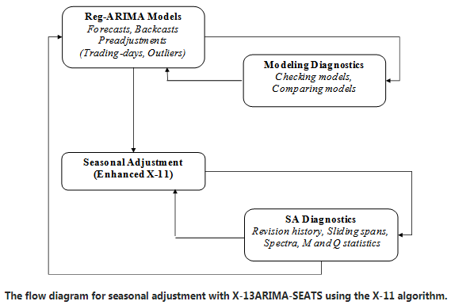

Seasonal Adjustment
======================

.. Template instructions are shown in italics (i.e. enclosed with asterisks * *)

.. A method specification describes, in detail, a statistical method which is to
    be implemented in the SML. Once implemented the specification must be kept up to date with respect to changes made.
    Specifications are used by business areas, Methodology, software engineers and anyone doing quality assurance.
    Each group has different needs and are likely to focus on different sections.
    For example, a software engineer implementing a method needs to:
    understand what the method does, have enough information to implement from scratch if necessary,
    and have a complete description of expected behaviour.
    By contrast someone from a business area is likely to need: an overview of what a method does,
    an understanding of what situations it can be used in, and a list of statistical products where it is already in use.

Overview
________

:Description: Seasonal adjustment is the procedure of estimating and removing regular variations in time series due to the time of year or calendar arrangement. Clearing away the seasonal component helps to identify underlying signal (trend and economic movements) in the series which may be masked by the regular seasonal fluctuations.
:Method theme: Time series
:Method classification: Time Series Statistical Processing

Method Specification
____________________

Method Specification Amendments/Change Log
^^^^^^^^^^^^^^^^^^^^^^^^^^^^^^^^^^^^^^^^^^

=================  =========================================  =============================  =============================  ========================================
Document version   Description                                Author(s)                       Date                           Comments
=================  =========================================  =============================  =============================  ========================================
*1.0.16*           Changes to existing spec descriptions      Atanaska Nikolova; 
                                                              atanaska.nikolova@ons.gov.uk   *Publication/amendment date*   Elaborating on the method description...
=================  =========================================  =============================  =============================  ========================================

Summary
_______

Seasonal adjustment allows for estimation and removal of regular variations in the series due to the time of year and arrangement of the calendar. The procedure decomposes the series into a long-term trend (including business cycle), seasonal component, and a residual irregular element. The three components are usually combined either in an additive or multiplicative way to form the original series. For example:

.. math::
    y = C * S * I (multiplicative)

.. math:: 
    y = C + S + I (additive)
    
Where :math:`C` is the trend-cycle, :math:`S` is the seasonal component and :math:`I` is the irregular. After decomposition the seasonal is either subtracted or divided from the original data :math:`y` to obtain the seasonally adjusted estimates. Economic time series are typically multiplicative, and by default the seasonal adjustment function will choose the best fitting decomposition. However, if the series has any zeroes or negative values, an additive decomposition will be performed.

The seasonal adjustment in *smlts* is done with the X13 non-parametric approach, which involves ARIMA modelling and a sequence of moving average filters used to decompose the series. 
Due to the use of ARIMA modelling, it is important that the series have a stochastic (random) element. If the time series is too regular or representing a constant value, seasonal adjustment will not be performed.

Note that even if the minimal number of observations is achieved and seasonal adjustment outputted, the quality will be very poor with small number of observations. As a rule of thumb, at least 5 years are needed to get good estimates. Seasonally adjusting series that are too long can also be problematic due to underlying changes in the economic context over time. Therefore, if the series is longer than 20 years, it may be preferable to limit the span to the more recent part.

Requirements and Dependencies
_____________________________

The input time series needs to be formatted in one of two ways - instants or observations. Missing values are permitted. See the time series parent page for more information.

Assumptions
___________

* Stochastic time series
* Minimum number of observations: 36 for monthly, 14 for quarterly, 8 for biannual
* Equally spaced observations 

Method Input
____________

* A time series DataFrame in one of two formats: instants or observations (see time series parent page for examples)
* The frequency of the input will be deduced from the dataframe dates. Accepted frequencies for seasonal adjustment are monthly, quarterly, and half-yearly (also called biannual for two observations per year). 

Method Output
_____________

A data frame in the same frequency and format as the input, containing the seasonally adjusted estimates.

Statistical Process Flow/Formal Definition
__________________________________________

The seasonal adjustment process includes pre-adjustment of the time series, in order to account for any deterministic effects (trading day effects, Easter, or different type of ourliers) that can distort the moving average filters. The process also includes extension of the time series  - forecast and backcast, so that symmetric moving averages can be applied (otherwise a symmetric linear filter cannot be applied to the first and last observations due to missing values). These two steps are done with regARIMA modelling (extending ARIMA models with linear regression). 

Following pre-adjustment of the series, the cleaned (prior-adjusted) series is subjected to iterations of moving averages in order to decompose it into trend, seasonal and irregular components. This step also includes correction for extreme values in the form of weights.

The user can select one of the folowing pre-defined specifications for seasonal adjustment, the default being DEF_X13_RSA5. 

.. csv-table::
    :header-rows: 1
    :file: specs_SA.csv
    :encoding: utf-8
    
Note that DEF_X13_RSAX11 is simply an application of the moving average algorithm without accounting for any deterministic effects in the series. Therefore, even though it is available as an option, it is not recommended for standard seasonal adjustment.
      
Worked Example
______________

Scenarios
_________

Treatment of Special Cases
__________________________

Example (Synthetic) Data
________________________

Code
____

Issues for Consideration
________________________

Unless the user has a good understanding of the statistical process, it is recommended that seasonal adjustment is performed using the default specification provided (see specifications table). If the series is to be used in a pipeline for official publications, the specifications may need to be reviewed and altered to fit the series. In these cases, the time series expert group should be contacted for assistance at TSAB@ons.gov.uk.

Tests and corrections for trading day or working day are only recommended for series of monthly frequency.

Seasonal adjustment should only be performed on seasonal series. It is recommended to do seasonality checks prior to applying the method, as well as tests for residual seasonality in the seasonally adjusted outputs. The user needs to consider if the annual totals of the seasonally adjusted outputs need to equal the annual totals of the original data, which is not the case by default. If this restriction is necessary, additional benchmarking needs to be performed after seasonal adjustment.

Links
_____

References
__________
Time series *smlts* parent page: https://collaborate2.ons.gov.uk/confluence/display/SML/Time+Series

JDemetra+ documentation on seasonal adjustment: https://jdemetradocumentation.github.io/JDemetra-documentation/pages/theory/SA_X11.html

JDemetra+ documentation on prior-adjustment with regARIMA modelling:
https://jdemetradocumentation.github.io/JDemetra-documentation/pages/theory/SA_lin.html

